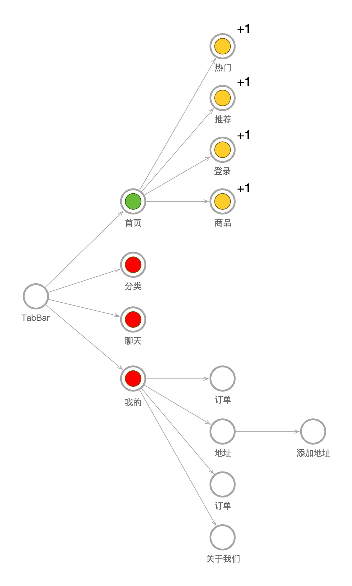
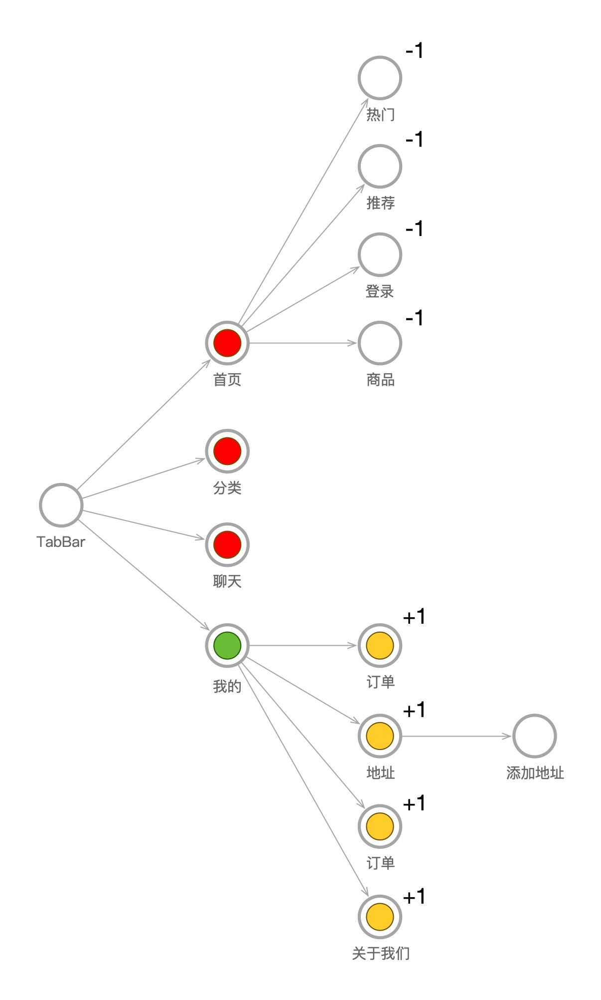
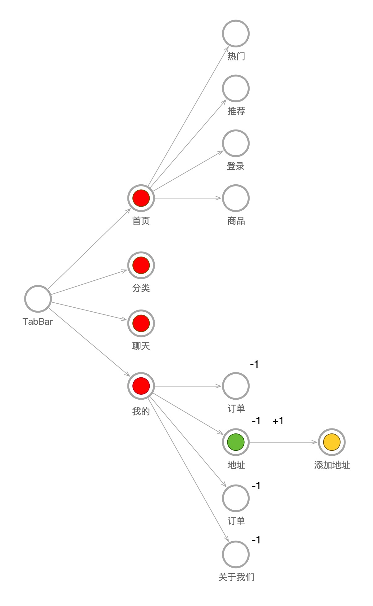

## RNBridge

    

功能：为iOS和RN混合项目进行拆包，并根据路径动态加载Bundle

版本：0.63.3，理论上0.60及日后的rn版本无需修改就能兼容

### 前提

阅读前需要了解rn打包机制，该文章只讲述如何动态加载rn页面。推荐文章如下： 
[React Native（二）：分包机制与动态下发](https://juejin.im/post/6844903922205736973)

### 思路
疑问1：如果程序全局仅包含一个RCTBridge，用户在使用APP的过程中不断的将业务包加载到Bridge对象中，会导致内存越来越大，即使退出页面，加载的业务包也不会被释放。 

在此基础的前提下，我决定**RCTBridge与业务一一对应**，进入rn页面加载Bridge，离开页面释放Bridge，如图所示：

疑问2：如果进入页面加载，离开页面释放，那么在进入页面的动画过程中，我们会看到页面闪白，这对用户体验来说...emmm...不太好

这个问题的解决方式说简单也简单，如果当前页面能够一步操作跳转到某个rn页面，那么该页面提前加载好Bridge，并且创建RCTRootView，进入rn页面时立即显示；离开该页面后，rn页面无法一步操作显示时，将Bridge与RCTRootView销毁。 
**不想看废话？直接拿图举例子：**

1. 假设图中的每个圈都是rn页面，首先TabbarController中根页面对应的RCTRootView必须被加载且无法被释放
2. 绿色表示当前显示页面，当显示在首页时，可以一步点击跳转到热门、推荐、登录、商品等页面，那么这些页面的RCTRootView也要加载并储存，同时通过oc引用计数的方式，计算页面是否加载或卸载
3. 我的页面中的订单、地址等页面，因为不能一步跳转，他们的Bridge均没有被加载

1. 现在用户点击了我的页面，那么首页中能够一步跳转的热门等页面引用计数-1，-1后他们的计数为0，因此他们的Bridge和RCTRootView被卸载了
2. 跳转到我的页面后，订单、地址等页面可以一步跳转，因此他们的Bridge与View被加载

1. 用户点击地址页面，此时订单、关于我们页面不能一步被跳转了，引用计数-1并且被卸载
2. 添加地址可以一步跳转了，因此他的应用计数+1并加载Bridge

### 总结
缺点：
1. rn页面被RCTBridge隔离开来，想要进行数据交互，只能通过原生来完成
2. 快速切换页面时，Bundle包可能未下载完或RCTBridge未加载完成，因此需要原生显示等待页以免页面空白

优点：
1. 内存会随着页面的离开而释放
2. 可以通过后台动态的更新页面

